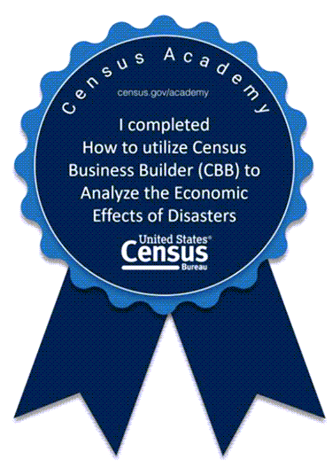
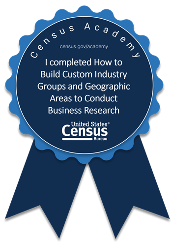
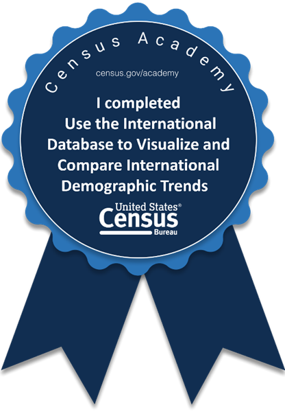
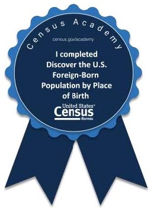

# Khan_Portfolio

## Credentials
##### Name : Hadeed Ahmed Khan
##### Graduation Year : 2026
##### Major : Data Science
##### Minor : Not Decided

## Introduction
##### I would like to go into the Finance side of Data Science for example Stocks, Real Estate etc 

## Course List
### University Courses :-
##### CS-190-01 : Secure Software Development
###### Description : Students will learn how to write, test, and debug programs using secure programming techniques. They will learn how to identify key characteristics and design patterns for secure coding, and develop programs in a secure environment using the software development life cycle  
##### JP-130-01 : Elementary Japanese I
###### Description : Teaches Basic Japanese to someone who has no knowledge of Japanese  
##### CS-241-01 : Python Programming
###### Description : Teaches Python programming and coding practice. Object-oriented concepts. Python use in Artificial Intelligence applications.
##### CS-260 : Information Technology Ethics
###### Description : Teaches the assessment of ethical principles within the application of information technologies to produce and store data and disseminate and use information.
##### IS-380 : Database & Data Administration
###### Description : Teaches students how database systems are used and managed, and the issues associated with protecting associated data assets. In addition, it will teach the methods to protect the confidentiality, integrity, and availability of data throughout the data life cycle.
##### BA-287-01 : Intro to Bus Analytics
###### Description : This course introduces students to some of the tools that businesses use to optimize their activities. Students will among others, learn how to use Excel Solver, POM QM and also conduct spreadsheet sensitivity analysis.
##### DS-210-01 : Intro to Data Science
###### Description : Students develop a critical comprehension of the fundamental principles of data science that guide the extraction of valuable information and knowledge from data. Students apply these concepts across the data science and analytics landscape within the contexts of business examples and other emerging fields.

### Other Courses :-
##### Udemy : "Java for Absolute Beginners"
###### Description : A course on Java for complete beginners to computer programming
###### Certificate Number : UC-f7ed446b-447f-4c5c-bb04-7a0d30874778 
###### Certificate URL : ude.my/UC-f7ed446b-447f-4c5c-bb04-7a0d30874778
##### Udemy : "Learn C and C++ (Beginner to Advance)"
###### Description : Teaches the basics of C++ to advanced topics like inheritance and polymorphism
###### Certificate Number : UC-0b855114-4ef1-ab8f-f6f440511aa1
###### Certficate URL : ude.my/UC-0b855114-4ef1-ab8f-f6f440511aa1    

### Census Academy Achievements

  

  

  

  

  

